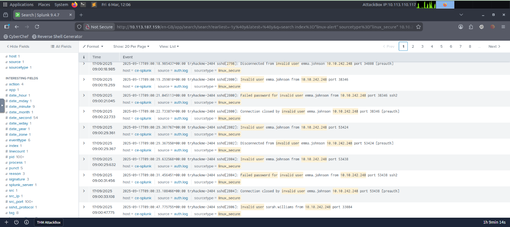
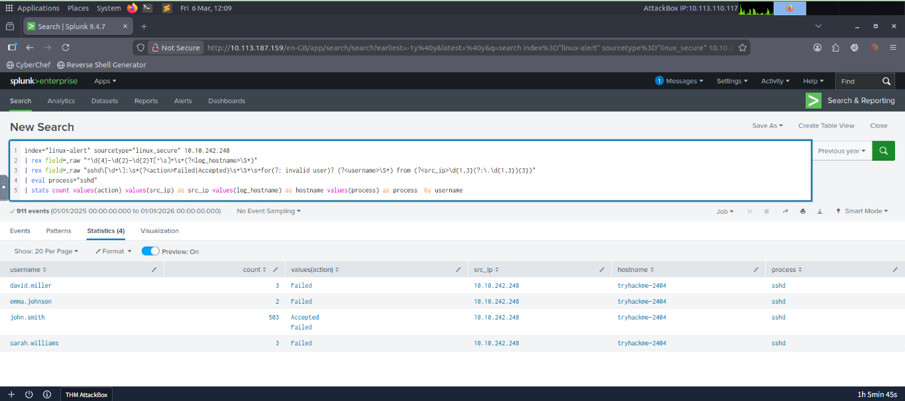

# 🔎 SOC Investigation Lab – Brute Force Attack Detection Using Splunk

## 📌 Overview

This lab simulates a **Security Operations Center (SOC) investigation** where an alert for potential brute force activity was triggered. Using **Splunk SIEM**, Linux authentication logs were analyzed to determine whether the alert represented a **true security incident or a false positive**.

The investigation focused on identifying:

- Failed login attempts
- Invalid user enumeration attempts
- Successful authentication events

Through log analysis, the alert was confirmed as a **True Positive**, since the attacker successfully gained access to a user account after multiple login attempts.

---

# 🚨 Alert Information

| Field | Value |
|------|------|
| Alert Name | Brute Force Activity Detection |
| Time | 17/09/2025 – 09:00:21 |
| Target Host | tryhackme-2404 |
| Source IP | 10.10.242.248 |
| Log Source | Linux Secure Logs |
| Index | linux-alert |

---

# 🧠 Initial Alert Assessment

The alert indicated a possible **SSH brute force attack** targeting the Linux host **tryhackme-2404**.

Observation:

- The **source IP (10.10.242.248)** is an internal IP.  
- Possibilities:
  - Attacker already has **internal network access**
  - Attacker compromised another **internal system**
  - Attacker connected through a **VPN**

---

# 🔍 Step 1 – Identify Authentication Activity

## Query

index="linux-alert" sourcetype="linux_secure" 10.10.242.248 
| search "Accepted password for" OR "Failed password for" OR "Invalid user"
| sort + _time
Explanation

This query searches authentication events from the source IP.

Filters:

- Accepted password for → successful login attempts

- Failed password for → failed login attempts

- Invalid user → attempts with non-existent accounts

- Sorting chronologically helps visualize the sequence of login attempts.

Findings

- Large number of authentication attempts

- Multiple attempts targeting invalid usernames

- Repeated login attempts from the same IP

- Attempts using invalid usernames indicate user enumeration, common before brute force attacks.

## Screenshot

🔍 Step 2 – Identify Targeted User Accounts

Query

index="linux-alert" sourcetype="linux_secure" 10.10.242.248
| rex field=_raw "^\d{4}-\d{2}-\d{2}T[^\s]+\s+(?<log_hostname>\S+)"
| rex field=_raw "sshd\[\d+\]:\s*(?<action>Failed|Accepted)\s+\S+\s+for(?: invalid user)? (?<username>\S+) from (?<src_ip>\d{1,3}(?:\.\d{1,3}){3})"
| eval process="sshd"
| stats count values(src_ip) as src_ip values(log_hostname) as hostname values(process) as process by username

Explanation

- Extracts fields from logs using rex:

- log_hostname → host generating the log

- action → login result (Failed or Accepted)

- username → targeted account

- src_ip → source IP

- eval process="sshd" labels the authentication process

- stats aggregates attempts by username

Findings

- Four user accounts were targeted

- john.smith → 503 login attempts

- Indicates a brute force attack on john.smith

## Screenshot

.png)

🔍 Step 3 – Determine if the Attack Was Successful

Query

index="linux-alert" sourcetype="linux_secure" 10.10.242.248
| rex field=_raw "^\d{4}-\d{2}-\d{2}T[^\s]+\s+(?<log_hostname>\S+)"
| rex field=_raw "sshd\[\d+\]:\s*(?<action>Failed|Accepted)\s+\S+\s+for(?: invalid user)? (?<username>\S+) from (?<src_ip>\d{1,3}(?:\.\d{1,3}){3})"
| eval process="sshd"
| stats count values(action) values(src_ip) as src_ip values(log_hostname) as hostname values(process) as process by username

Explanation

This query also captures login results (Accepted or Failed) per user.

- Aggregates total attempts, actions, IP, hostname, process

- Determines if brute force attack led to successful login

Findings

- Account john.smith had both Failed and Accepted login attempts

- Confirms attacker successfully logged in after multiple attempts

📊 Final Analysis

- Hundreds of login attempts detected

- User enumeration occurred

- john.smith specifically targeted

- Successful SSH login achieved

Alert represents a True Positive brute force attack

🕒 Attack Timeline
Time	Event
- 09:00	Initial login attempts detected from 10.10.242.248
- 09:01	Multiple failed SSH login attempts recorded
- 09:03	Attempts using invalid usernames
- 09:05	Brute force attempts increase against john.smith
- 09:07	Successful login for john.smith

🧠 MITRE ATT&CK Mapping
- Technique	ID	Description
- Brute Force	T1110	Repeated login attempts to guess account credentials
- Valid Accounts	T1078	Successful login using compromised credentials
- Initial Access	TA0001	Gaining initial access to the host through SSH

🚩 Indicators of Compromise (IOCs)
- Indicator Type	Value
- Source IP	10.10.242.248
- Target Host	tryhackme-2404
- Target Account	john.smith
- Log Source	linux_secure
- Attack Type	SSH Brute Force

🛡 Detection Logic

- Detected high volume of failed SSH login attempts

- Attempts using invalid usernames

- Multiple login attempts targeting a single user account

- Successful login following multiple failed attempts

- This logic triggered the Brute Force Activity Detection alert.

🚑 Recommended Response Actions

- Disable or reset the compromised account (john.smith)

- Investigate source system (10.10.242.248)

- Review authentication logs for other suspicious activity

- Check for post-login privilege escalation attempts

- Implement account lockout policies to prevent brute force

- Enforce multi-factor authentication (MFA) for SSH

🛠 Tools Used

- Splunk SIEM

📚 Skills Demonstrated

- SOC Alert Investigation

- Splunk Log Analysis

- Linux Authentication Log Analysis

- Brute Force Attack Detection

- Incident Classification
